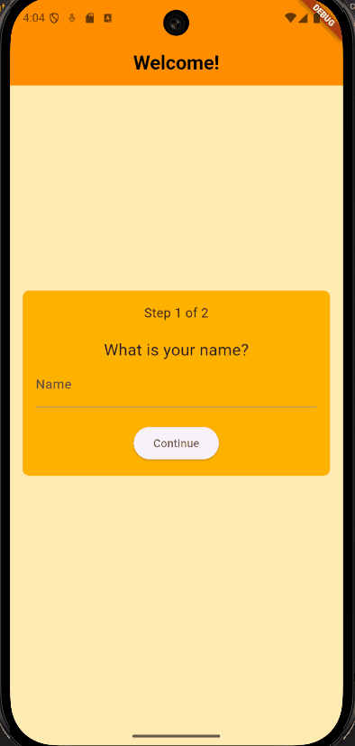
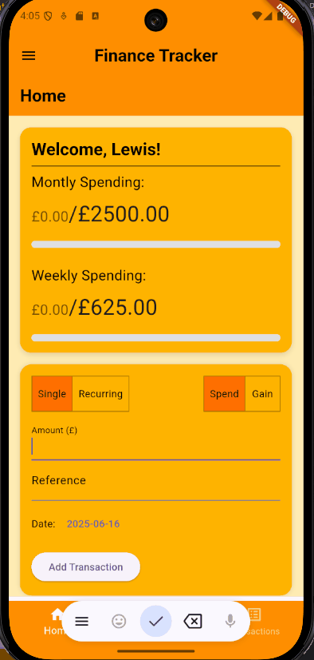
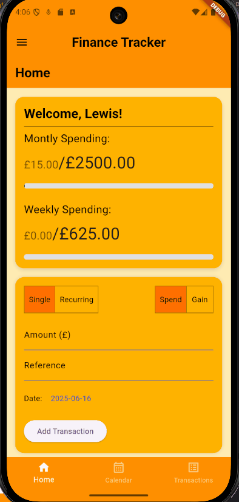
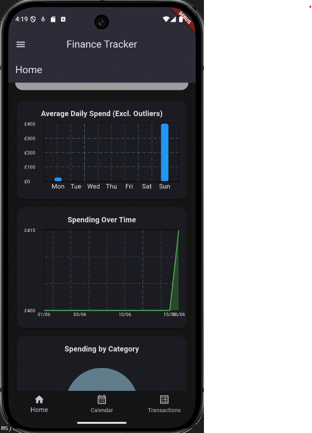
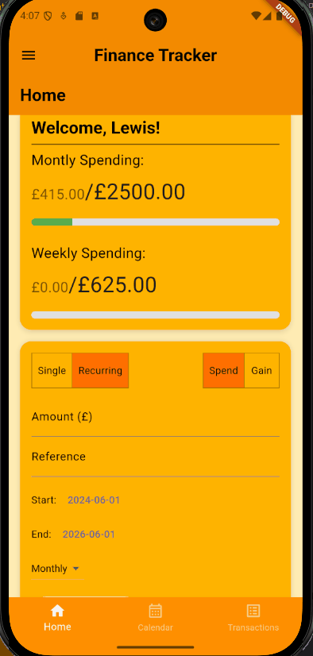
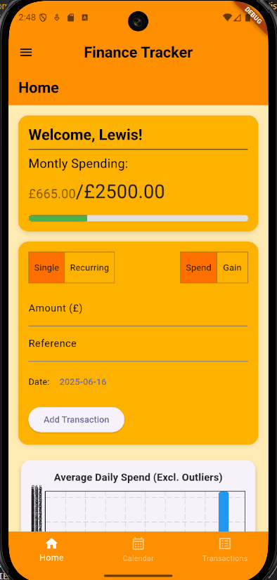
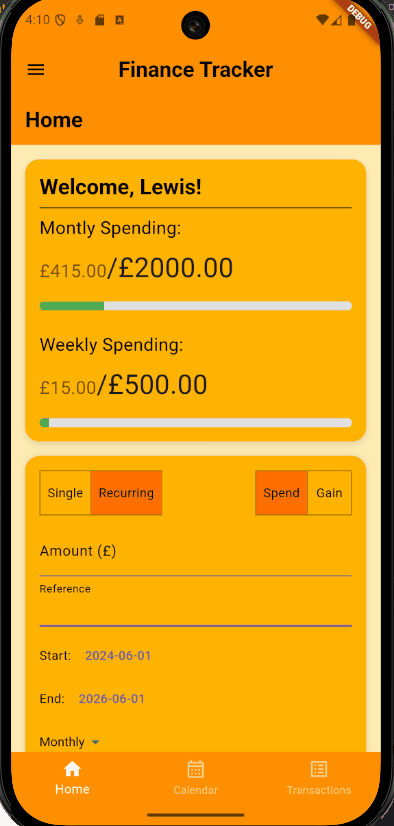
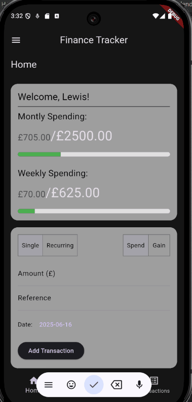

# Android Finance Tracker

---

## Overview

This project explores the use of flutter and dart to create a basic finance tracking app. The project aims to be a learning tool for myself to learn android development, while also serving as a replacement for tracking my finances using a basic spreadsheet.

The app allows the user to set a monthly budget, and then add transactions over time. Transactions can be dated to any time, and recurring daily/weekly/monthly payments can be easily set up. Basic finacial insights are provided, such as average daily spending, spending over the span of the current month, and amount of spending per category. These insights update as new transactions are added. The users transactions can be viewed from a calendar, or in a list format.

---

## Installation

To use this app, download the `finance.apk` file to your android device. Run this file to install the app.

---

## Features

Upon launching the app first the first time, you will be prompted to enter your name and your monthly budget. This forms the basis of the apps money tracking features, and allows you to see how much money you have spent or have left.

On the home page, you will be greeted by a welcome message and a budget progress tracker, as well as a transaction adder and basic graphs. To begin tracking your spending, add a single or recurring transaction. Single transactions can be dated to any time, and can have any positive value with or without a reference. If you have gained money, choose the gain option. Recurring transactions begin on the start date, and recur either daily, weekly, or monthly until the end date. These may have any positive values, with or without a reference. Any transactions made will affect the related graphs.

Opening the second page from the navigation bar brings you to the calendar page. Here you can view your transactions within a calendar. Clicking on a day will show you a list of transactions for that day, and allow you to remove transactions if needed.

Opening the third page from the navigation bar brings you to the transaction list page. All transactions scheduled for the future are stored in a collapseable section at the top of the page. All other transactions are shown in order below.

Opening the drawer in the top left corner opens the settings drawer. From here, you may change the app's theme to dark mode, change your name or budgets in the settings, delete your transaction data, or delete your settings.

